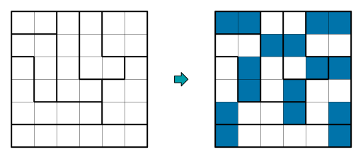
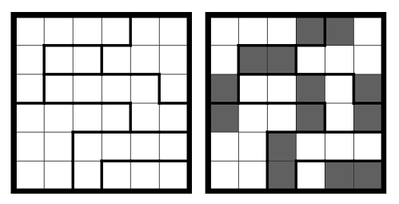
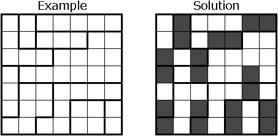
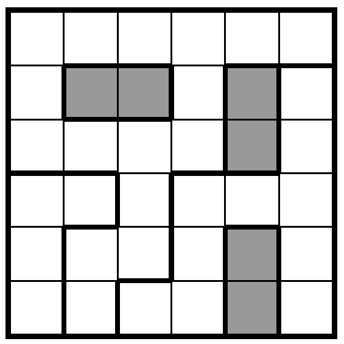
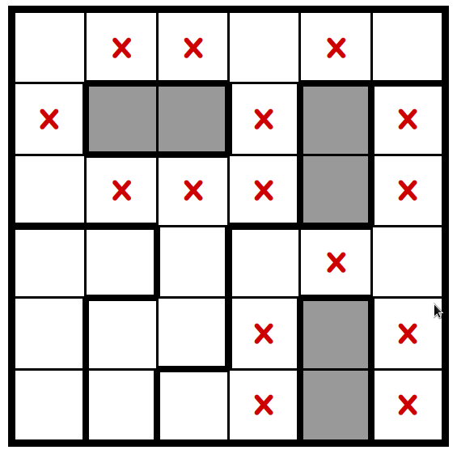
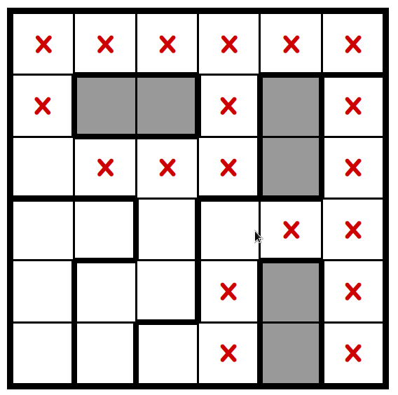
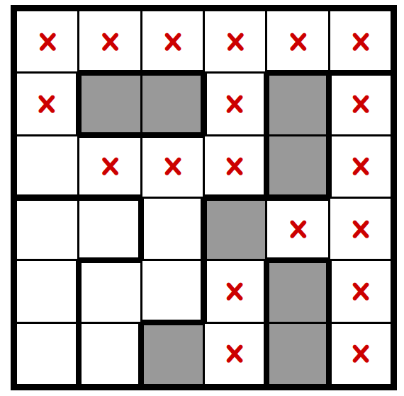
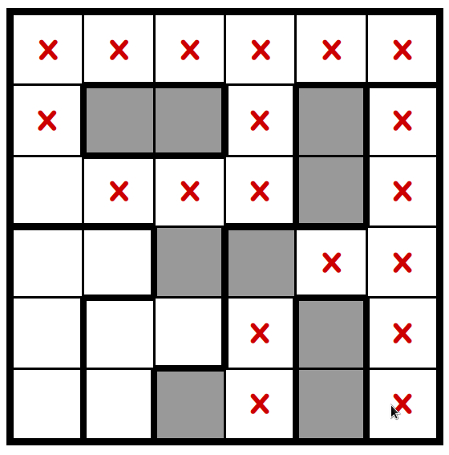
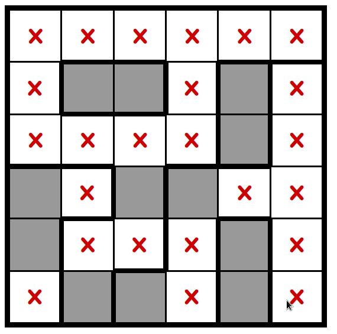
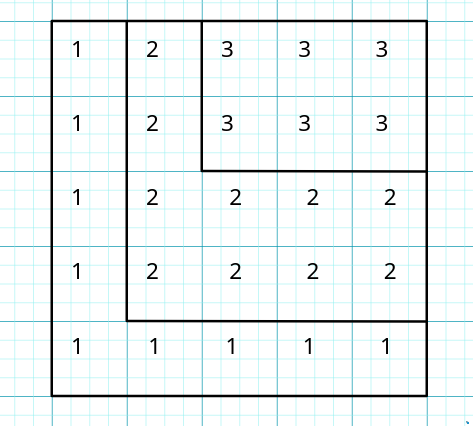

# Rapport projet

__Pascal Isak & Givre Zolan & Weber Loïc__

## Table of Content

## Information et dates.
Dates :  
1) pré-rapport décrivant la partie modélisation : 10 mars 2023
2) Rapport final + code source 28 avril 2023

## Rapport.

### Presentation du jeu.
Le jeu que nous avons choisi est NoriNori.   

  
Le jeu commence avec une grille de X cases dans laquelle est préalablement défini un certain nombre de zones distinctes.  

#### Règles.
Le but du jeu est de completer la grille en suivant ces 3 règles:

1) Chaque zone doit avoir un total de 2 cases coloriées.
2) Les cases coloriées sont toujours par pair de 2 indépendament des limites des zones.
3) On ne peux pas coller cote a cote deux pairs (mais on peut diagonalement).

#### Exemples.
  

#### Contraintes & Remarques.

Il y a une unique solution si la grille est générée correctement.

Nous avons remarquée plusieurs cas qui permette d'avancer dans la grille :

- Les zones constituées d'exactement deux cases sont toujours a coloriées elles feront toujours partie de la solution finale.  
   
- Toutes les cases cote à cote aux cases coloriées deviennent donc inutilisable car ne respectent plus la règle N°3  
  
- Toutes les cases seules et entourées par des cases inutilisable deviennent aussi inutilisable.  

- Les zones dans lequels il ne reste plus que deux cases peuvent etre coloriées.   
   
- Ensuite on peut completer les cases coloriées qui ne sont pas par pair et qui n'ont plus que une seule solution.  
  

Et apres on peut réutiliser les étapes précédentes jusqu'a ce que notre grille soit complétée.  
  
(Attention ces étapes ne sont pas exhaustive, il existe tres probablement des grilles dans lequels appliquer ces étapes ne suffisent pas.)


### Traduction du problème en logique.
Premièrement nous avons traduit simplement le fait de dire qu'une case est coloriée ou non.  

$$ 
(i,j) \text{ : la case de coordonées (i,j) est coloriée} \\ (i,j) \in [1,n]^2
$$  
n étant la taille de la grille.

$$  
\neg (i,j) \text{ : la case de coordonées (i,j) n'est pas coloriée}
$$  
#### règles 2) et 3)
Rappel :  

2) Les cases coloriées sont toujours par paire de 2 indépendament des limites des zones.
3) On ne peux pas coller côte a côte deux paires (mais on peut diagonalement).

Pour modéliser le problème, on commence par fusionner les règles 2) et 3).  
Si une case est coloriée, alors elle a une et une seule case coloriée à coté d'elle.  

On va simplifier "alors elle a une et une seule case coloriée à coté d'elle" en deux règles.  

1) Elle a au moins une case coloriée a coté d'elle  
  qui se traduit simplement avec une disjonction
3) Elle a au plus une case coloriée a coté d'elle  
  qui se traduit en logique comme: "elle n'a acune paire de case adjacente coloriée"

$$
\text{(1) :} \\ (i+1,j) \lor (i-1,j) \lor (i,j+1) \lor (i,j-1) \\ 
$$

$$
\text{(2) :} \\ \phantom{..}\neg ((i+1,j)\land (i-1,j)) \\ \land \neg ((i+1,j)\land(i,j+1)) \\ \land \neg ((i+1,j)\land (i,j-1)) \\ \land \neg ((i-1,j)\land(i,j+1)) \\ \land \neg ((i-1,j)\land(i,j-1)) \\ \land \neg ((i,j+1)\land(i,j-1))
\\ \text{}
\\\equiv (\neg (i+1,j)\lor \neg(i-1,j)) 
\\ \land (\neg(i+1,j)\lor \neg(i,j+1)) 
\\ \land (\neg(i+1,j)\lor \neg(i,j-1)) 
\\ \land (\neg(i-1,j)\lor \neg(i,j+1)) 
\\ \land (\neg(i-1,j)\lor \neg(i,j-1)) 
\\ \land (\neg(i,j+1)\lor \neg(i,j-1)) \\ 
$$

la règle est donc:

$$
(i,j) \Rightarrow (1) \land (2)
\\ \text{}
\\ \equiv (i,j) \Rightarrow
\\ ((i+1,j) \lor (i-1,j) \lor (i,j+1) \lor (i,j-1)) \\  
\\ \land (\neg (i+1,j)\lor \neg(i-1,j)) 
\\ \land (\neg(i+1,j)\lor \neg(i,j+1)) 
\\ \land (\neg(i+1,j)\lor \neg(i,j-1)) 
\\ \land (\neg(i-1,j)\lor \neg(i,j+1)) 
\\ \land (\neg(i-1,j)\lor \neg(i,j-1)) 
\\ \land (\neg(i,j+1)\lor \neg(i,j-1))
$$
on applique $A \Rightarrow B \equiv \neg A \lor B$

$$
\\ \equiv \neg (i,j) \lor \big[
\\ ((i+1,j) \lor (i-1,j) \lor (i,j+1) \lor (i,j-1)) \\  
\\ \land (\neg (i+1,j)\lor \neg(i-1,j)) 
\\ \land (\neg(i+1,j)\lor \neg(i,j+1)) 
\\ \land (\neg(i+1,j)\lor \neg(i,j-1)) 
\\ \land (\neg(i-1,j)\lor \neg(i,j+1)) 
\\ \land (\neg(i-1,j)\lor \neg(i,j-1)) 
\\ \land (\neg(i,j+1)\lor \neg(i,j-1))
\\ \big]
\\ \text{}
\\ \equiv
\\ \text{[} \neg(i,j) \lor (i+1,j) \lor (i-1,j) \lor (i,j+1) \lor (i,j-1)] \\  
\\ \land [\neg(i,j) \lor \neg (i+1,j)\lor \neg(i-1,j)] 
\\ \land [\neg(i,j) \lor \neg(i+1,j)\lor \neg(i,j+1)]
\\ \land [\neg(i,j) \lor \neg(i+1,j)\lor \neg(i,j-1)] 
\\ \land [\neg(i,j) \lor \neg(i-1,j)\lor \neg(i,j+1)] 
\\ \land [\neg(i,j) \lor \neg(i-1,j)\lor \neg(i,j-1)] 
\\ \land [\neg(i,j) \lor \neg(i,j+1)\lor \neg(i,j-1)]
$$

Il faut donc appliquer cela pour chaque case.  
N'oublions pas le cas spécial des case au bors de la grille. Deux aproches possibles:  

1) modifier la regle des case du bord pour que la case colorié adjacente soit sur le terrain.  
2) garder la même règle pour les cases au bord et rejouter une ligne de cases autour du terain.

Nous prennons la deuxième option car elle ne rajoute pas beaucoup de calcul au solveur sat et nous évite de faire des cas particuliers.
Pour cela nous acceptons les cases de coordonés (0,j), (n+1,j), (i,0), (i, n+1), $ i,j \in [1,n]$ . On rajouteras alors les conditions:

$$
\overset{n}{\underset{i=1}{\Large \land}} \big( \space \neg (i,0) \land \neg (i,n+1) \space \big)
\land \overset{n}{\underset{j=1}{\Large \land}} \big( \space \neg (0,j) \land \neg (n+1,j) \space \big)
$$


#### Règle 1)

*note: $\{C_j \mid 0\leq j < n\}$ est l'ensemble des cases de la zone z de n éléments*

##### Un exemple :
Soit z une zone.  
- Cas z, une zone de 5 éléments {A,B,C,D,E}.  

On sait qu'il doit y avoir exactement 2 cases coloriées dans la zone :  
Une stratégie pour modeliser cette règle est de divide et impera :  

**On sépare la règle "exactement 2" en : $\text{Au moins 2 } \land \text{ Au plus 2}$**   
(On fait ça, car on a essayé de directement faire une règle "exactement 2" mais elle était beaucoup trop longue)

**Au moins 2** :  

$$
(A \lor B \lor C \lor D) \land (A \lor B \lor C \lor E)
\land (A \lor B \lor D \lor E) \land (A \lor C \lor D \lor E)
\land (B \lor C \lor D \lor E) 
$$

**Au plus 2** :  

$$
\neg (A \land B \land C) \land \neg (A \land B \land D) \land \neg (A \land B \land E) \\
\land \neg (A \land C \land D) \land \neg (A \land C \land E) \land \neg (A \land D \land E) \\ \land \neg (B \land C \land D) \land \neg (B \land C \land E) \land \neg (B \land D \land E) \\ \land \neg (C)\land D \land E)\\
\text{} \\ 
\equiv \\
(\neg A \lor \neg B \lor \neg C) \land (\neg A \lor \neg B \lor \neg D) \land (\neg A \lor \neg B \lor \neg E) \\
\land (\neg A \lor \neg C \lor \neg D) \land (\neg A \lor \neg C \lor \neg E) \land(\neg A \lor \neg D \lor \neg E) \\
\land (\neg C \lor \neg D \lor \neg E)
$$

##### Cas général:

Nous devons maintenant généraliser la règle et nous proposons de l'écrire comme suit:


**au moins 2**

$$
\overset{n}{\underset{i=1}{\Large \land}}\big( \space \overset{n}{\underset{\underset{\scriptsize j\neq i}{j=1}}{\Large \lor}}(C_j) \space \big)
$$

**Preuve que la formule fonctionne :**  
Supposons qu'il existe $C_a$ et $C_b$ vrai.
on a :

$$
\\ \overset{n}{\underset{i=1}{\Large \land}}\big( \space \overset{n}{\underset{\underset{\scriptsize j \neq i}{j=1}}{\Large \lor}}(C_j) \space \big)
\\
\\ \equiv \big( \space \overset{n}{\underset{\underset{\scriptsize j \neq a}{j = 1}}{\Large \lor}}(C_j) \big)
\\
\\ \land \overset{n}{\underset{\underset{\scriptsize i \neq a}{i=1}}{\Large \land}}\big( \space \overset{n}{\underset{\underset{\scriptsize j\neq i}{j=1}}{\Large \lor}}(C_j) \space \big)
\\
\\ \equiv \big(\big(\overset{n}{\underset{\underset{\scriptsize j\neq a,b}{j=1}}{\Large \lor}}C_j \space \big) \lor \underset{\color{LimeGreen} \text{vrai}}{C_b} \big)
\\ \land \overset{n}{\underset{\underset{\scriptsize i \neq a}{i=1}}{\Large \land}}\big( \space \overset{n}{\underset{\underset{\scriptsize j\neq i,a}{j=1}}{\Large \lor}}(C_j) \lor \underset{\color{LimeGreen} \text{vrai}}{C_a}\space \big) \equiv \top
$$


**au plus 2**

$$
\\ \overset{n}{\underset {\underset {\underset {\underset{\scriptsize j \neq k}{\scriptsize i \neq k}}{\scriptsize i \neq j}}{i,j,k=1}}{\Large \land}} 
\\ \neg \big( C_i \land C_j \land C_k \big)\\
\\ \equiv \\
\\ \overset{n}{\underset {\underset {\underset {\underset{\scriptsize j \neq k}{\scriptsize i \neq k}}{\scriptsize i \neq j}}{i,j,k=1}}{\Large \land}} 
\\ \big( \neg C_i \lor \neg C_j \lor \neg C_k \big)\\
$$


### Modelisation sous forme normale conjonctive.

$$
\\ \text{[} \neg(i,j) \lor (i+1,j) \lor (i-1,j) \lor (i,j+1) \lor (i,j-1)] \\  
\\ \land [\neg(i,j) \lor \neg (i+1,j)\lor \neg(i-1,j)] 
\\ \land [\neg(i,j) \lor \neg(i+1,j)\lor \neg(i,j+1)]
\\ \land [\neg(i,j) \lor \neg(i+1,j)\lor \neg(i,j-1)] 
\\ \land [\neg(i,j) \lor \neg(i-1,j)\lor \neg(i,j+1)] 
\\ \land [\neg(i,j) \lor \neg(i-1,j)\lor \neg(i,j-1)] 
\\ \land [\neg(i,j) \lor \neg(i,j+1)\lor \neg(i,j-1)] 
\\ \land 
\\ \overset{n}{\underset{i=1}{\Large \land}}\big( \space \overset{n}{\underset{\underset{\scriptsize j\neq i}{j=1}}{\Large \lor}}(C_j) \space \big)
\\ \land
\\ \overset{n}{\underset {\underset {\underset {\underset{\scriptsize j \neq k}{\scriptsize i \neq k}}{\scriptsize i \neq j}}{i,j,k=1}}{\Large \land}} 
\\ \big( \neg C_i \lor \neg C_j \lor \neg C_k \big)\\
$$

## Les programmes.
### Formalisation d'un problème dans un fichier.

Nous avons choisis la structure de fichier suivant pour modeliser nos grilles :

```:fichier.liz
hauteur(nombre entier positif);
largeur(nobmre entier positif);
nb_zone(nombre entier positif non nulle);
numero_zone_case_1_1;..............;numero_zone_case_L_1;
........................................................;
..................numero_zone_case_i_j..................;
........................................................;
numero_zone_case_1_H;..............;numero_zone_case_L_H;

(Attention les \n ne sont pas obligatoire pour le format du fichier donc on peut tout écrire sur une seule ligne.)
```

Exemple :

```:ma_grille_nori_nori.liz
5;
5;
3;
1;2;3;3;3;
1;2;3;3;3;
1;2;2;2;2;
1;2;2;2;2;
1;1;1;1;1;
```

ou bien :

```:ma_grille_nori_nori2.liz
5;5;3;1;2;3;3;3;1;2;3;3;3;1;2;2;2;2;1;2;2;2;2;1;1;1;1;1;
```

Ce qui donne la grille suivante :  

### Parsing du fichier en Python :

```python:parsing_fichier_liz.py
import sys #Pour recuperer le nom du fichier a parse.

def parsing_fichier(fichier):
  # On ouvre le fichier
  f = open(fichier)
  lines_in_list = f.readlines()
  f.close()
  
  line = ""
  # On concatene toutes les lignes pour n'en faire que une.
  for elem in lines_in_list:
      line += elem

  c = 0
  buffer = ""
  info_grille = []
  nbr_separator_seen = 0

  # Parsing des info de la grille info_grille = [largeur, hauteur, nb_zone]
  while nbr_separator_seen < 3:
      if line[c] == ';':
          nbr_separator_seen += 1
          info_grille.append(int(buffer))
          buffer = ""
      else:
          buffer += line[c]

      c += 1

  # On recupere les information de la grille dans des variables
  largeur = info_grille[0]
  hauteur = info_grille[1]
  nb_zones = info_grille[2]
  #print(info_grille)

  # On crée une matrice vide de la taille de notre grille
  matrix = [[0 for y in range(hauteur)] for x in range(largeur)]

  # On parse le fichier dans la matrice
  i, j = 0, 0
  for c in range(c, len(line)-1):

      if j == largeur:
          j = 0
          i += 1

      if line[c] == ';':
          matrix[i][j] = int(buffer)
          buffer = ""
          j += 1

      else:
          buffer += line[c]

  #print(matrix)
  return info_grille,matrix

if __name__ == "__main__":
  info_grille, matrix = parsing_fichier(sys.argv[1])
  print(info_grille)
  print(matrix)
  
```

On peut l'executer en faisant : `python parsing_fichier_liz.py ma_grille.liz`

### Parsing en Ocaml :

```Ocaml:parsing_fichier_liz.ml

type largeur = int;;
type hauteur = int;;
type nb_zones = int;;

type case = int*int;;
type list_zone = case list list;;
type jeu = largeur*hauteur*nb_zones*list_zone;;

type etat_automate = Largeur|Hauteur|Zone|Fin|CS of (int*int);; (*CS((x,y),liste_de_collones,colonne)*)
type mem_automate = jeu*int*etat_automate;;

let print_jeu ((larg, haut, zone, l): jeu) = 
    (*
    | SPÉCIFICATION
    | print_jeu : affiche dans le terminal le jeu.
    | - Profil : append_n_eme : element -> int -> 'a list list -> 'a list list
    | - Sémantique : (append_n_eme element int ('a list list) ('a list list)) : 
    | - Exemple et propriétés :
    |   (a) automate (5) (2) ([[0;1];[3;4];[]]):  [[0;1];[3;4];[5]]
    |   (b) automate ('u') (0) ([couco]):  [[coucou]]
    | - Implémentation :
*)
    let p_iteri (index: int) (l: case list) =
        let () = Printf.printf "    %d: [ " (index+1) in
        let () = (List.iter (fun (x,y) -> Printf.printf "(%d,%d); " x y) l ) in
        let () = Printf.printf "]\n" in
        ()
    in
    let () = Printf.printf "largeur: %d\nhauteur: %d\nnombre de zones: %d\ndictionnaire de zone:\n" larg haut zone  in
    let () = List.iteri p_iteri l in
    ()
;;

let rec append_n_eme (element: 'a) (n: int) (pr::fin: 'a list list): 'a list list =
    (*
    | SPÉCIFICATION
    | append_n_eme : rajoute un élément à la n eme liste de la liste de liste donné en argument.
    |                /!\ premier élément d'indice 0.
    |                /!\ la liste de liste donné doir avoir au moins n+1 listes (pour pouvoir incrémenter la n eme liste).
    | - Profil : append_n_eme : element -> int -> 'a list list -> 'a list list
    | - Sémantique : (append_n_eme element int ('a list list) ('a list list)) : 
    | - Exemple et propriétés :
    |   (a) automate (5) (2) ([[0;1];[3;4];[]]):  [[0;1];[3;4];[5]]
    |   (b) automate ('u') (0) ([couco]):  [[coucou]]
    | - Implémentation :
*)
    match n with
    | 0 -> (element::pr)::fin 
    | n -> pr::(append_n_eme element (n-1) fin)
    [@@warning "-8"]
;;

let automate (((larg, haut, zone, gril), nb, etat):mem_automate) (carac:char): mem_automate=
(*
    | SPÉCIFICATION
    | automate : a utiliser dans un String.fold_left, parse le fichier.
    | - Profil : automate : mem_automate -> char -> mem_automate
    | - Sémantique : (automate  mem_automate  char  mem_automate) : la fonction modifie mem_automate en fontion du caractere donnee et de son etat.
    | - Exemple et propriétés :
    |   (a) automate ((0, 0, 0, []), 15, Largeur) (';'): ((15, 0, 0, []), 0, Hauteur)
    |   (b) automate ((15, 0, 0, []), 2, Hauteur) ('4'): ((15, 0, 0, []), 24, Hauteur)
    | - Implémentation :
*)
    match carac,etat with
    | ';',Largeur ->    ((nb(*<- enregistre la largeur ici*), haut, zone, gril), 0, Hauteur) 
    | ';',Hauteur ->    ((larg, nb, zone, gril), 0, Zone)
    | ';',Zone ->       ((larg, haut, nb, List.init nb (fun x -> [])), 0, CS(1,1))
    |  _ ,Fin ->        ((larg, haut, zone, gril), 0, Fin)
    | ';',CS((x,y)) -> if (x == larg)
                        then if (y == haut) 
                            then ((larg, haut, zone, (append_n_eme (x,y) (nb-1) gril)), 0, Fin)
                            else ((larg, haut, zone, (append_n_eme (x,y) (nb-1) gril)), 0, CS(1,y+1))
                        else ((larg, haut, zone, (append_n_eme (x,y) (nb-1) gril)), 0, CS(x+1,y))
    | a,etat -> (*etat!=Fin*) if (((Char.code a) >= 48) && ((Char.code a) <= 57))
       then ((larg, haut, zone, gril), nb*10 + (Char.code a) - 48 (*ascii(48) = '0'*) , etat)
        else ((larg, haut, zone, gril), nb, etat) (* si le carac n'est pas reconus en tant que chiffre, on le passe*)
;;

let lire_fichier (file: string) : jeu = 
    (*
    | SPÉCIFICATION
    | automate : permet douvrir un fichier, de le parser et retourner le jeu corespondant.
    | - Profil : automate : string -> jeu
    | - Sémantique : (lire_fichier string) : récupère toutes les lignes puis applique un String.fold_left avec l'automate et retourne le jeu renvoyé.
    | - Implémentation :
*)
    let lines_array = Array.to_list (Arg.read_arg file) in (*on recupere les lignes*)
    let lines =  String.concat "" lines_array in (*on concatene toutes les lignes*)
    let (mon_jeu, _, _) = (String.fold_left (automate) ((((0,0,0,[]): jeu), 0, Largeur):mem_automate) lines ) in (*on parse*)
    mon_jeu (*return*)
;;

let file:string = ( if (Array.length Sys.argv == 2)
then Sys.argv.(1) (*le fichier est donné en argument*)
else "test.liz");; (*nom de fichier pas defaut*)
let mon_jeu = lire_fichier file;; (* on parse le fichier *)

print_jeu mon_jeu;; (*affichage de jeu*)
```


### Formalisation d'une entree en logique propositionnelle.

Maintenant que nous avons une matrice en Python ou bien un dictionnaire en OCaml representant notre instance, nous devons la transformée forme de logique propositionnelle.

### Conversion d'une instance au format DIMACS.

### Afficheur de solution.
### Programme principale qui utilise les autre progs.

## Les instances tests
### instance basique probleme simplifiée
### instance normal avec la majorité des cas de figure
### instance problématique avec cas de figure critiques
### instance avec tout les cas de figure
### ...

## Soutenance.
### Présentation du jeu.
### Explication transformation des règles en logique.
### Explication des algorithmes.
### Demonstration des algorithmes.
### Conclusion.
